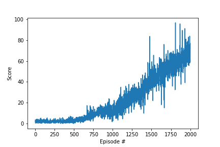

## Algorithm

Agent is implemented as a deep deterministic policy gradient (DDPG) agent with experience replay and soft updates. DDPG algorithm consists of two deep neural networks; an actor and a critic. The actor takes the environment state as a input and outputs an action. While the critic take the envirnoment state and the action from the actor as inputs and outputs the expected Q-value for the environment's next state.

The actor (policy network) is approximated with two identical neural networks. Each network contains two fully connected dense layers with 512 neurons and Relu activations\. The final dense layer is activated with tanh and contains 4 neurons representing one of four actuators available to the agent to move. 

The critic (Q-value) is approximated with two identical neural networks. Each network contains two fully connected dense layers with 512 neurons and Relu activations\. The final dense layer contains 4 neuron representing each of the actions available to the agent. 

## Result

Agent solves the challenge after approximately 1,400 episodes. 

## Hyperparameters

| Parameter            | Description                                                  | Value  |
| -------------------- | ------------------------------------------------------------ | ------ |
| batch_size           | Number of prior episodes used to update target network.      | 128    |
| target_update_step   | Number of steps agent takes before updating the target network. | 20     |
| gamma                | Discount rate of future value estimates.                     | 0.99   |
| tau                  | Rate of averaging policy network and target network weights. | 0.001  |
| learning_rate_actor  | Actor's learning rate                                        | 0.0001 |
| learning_rate_critic | Critic's learning rate                                       | 0.0005 |

## Improvement ideas

Implementing prioritized experience replay will help the agent learn from infrequent exerpiences better. Additionally, using double deep Q-learning to independantly select an action and evaluate the action will reduce over estimation.